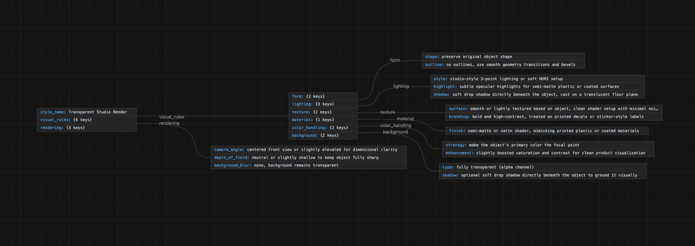

# Patch Prompter

| | |
| --- | --- |
|Author: | Cameron Browning |
|Last Updated: | 08/14/2025 |

# Overview
Patch Prompter is a node-based workflow for generating text and image-based AI prompts. 

For similar examples of patch programming, see [TouchDesigner](https://derivative.ca/), [vvvv](https://vvvv.org/), [Blender Geometry Nodes](https://docs.blender.org/manual/en/latest/modeling/geometry_nodes/introduction.html), [Max](https://cycling74.com/products/max), or [ComfyUI](https://www.comfy.org/).

While ComfyUI seeks to build complex and repeatable workflows for local genAI models, Patch Prompter is a thin layer for creating batches that can be sent to any AI model, saved, and shared. An observability and human-in-the-loop feedback system will help with how the prompt systems are built, and ultimately will help create more beautiful images and moving pictures with AI, driven by artists.

## Impetus

Right now, commercial artists using AI in their creative process for large studios are using their own unique workflows, built from a patchwork of different models. They use trial-and-error to build text prompts to realize their vision with genAI systems. These techniques, often shared online, sometimes do not even reflect the way the underlying systems work. By collecting data about what components of prompts work on these systems, creatives can share their successes with artists and get more consistent results, ultimately leading to better outcomes for clients, faster.

# Use Case & Workflow
The Use Case for Patch Prompter is for a Creative Director who is looking for a specific look and wants to roll out a particular style to a large team of artists to match, and improve upon over the course of a project.

1. The Creative Director uses Patch Prompter to generate a good "look" or example output for a project.
2. The Creative Director uses an up and down-voting system to tag the outputs they got along the way to getting their look.
3. The Creative Director downloads their best work, which both flags to the Patch Prompter database, that the image was downloaded (upvoting it highly). This download includes the prompt data in the image metadata.
4. Artist teams can then import the example works, and reconstitue the "patch" that created the prompt. They use this node graph to generate new content for a campaign, adding their own prompt components and improvements along the way.
5. The next time the Creative Director starts a project, they have new templates, and suggestions for prompt components (with example thumbnails) available so they never start from scratch again.
6. Executive Creative Directors can also observe across projects what outputs are working, and what prompts are consistently used, using Langsmith observability.
7. Stretch goal: Creative Directors can provide plain english descriptions of the project they're on, and receive suggested prompt components using RAG.

By using a system like this, the prompt data is always saved, easily accessible, including the details about what genAI model is used. The Patch Prompter features help with new improvements, but the prompt and model metadata should allow others not using Patch Prompter to recreate similar images using the basic ChatGPT UI as well.

## Prototype and Vibe-Coded Example


Rough-and-ready prototype can be found [here](prototype/)


# AI Features to Be Implemented (for MVP v0.1)
- Prompt Engineering
  - The MVP for Prompt Patcher is essentially a playground-like tool for experimenting with prompt engineering. While there are many browser-based playgrounds for testing text-based LLMs, it remains difficult, outside of a ComfyUI environment, to make creative decisions around genAI prompts. By adding a scoring system to image outputs, data will be collected around successful prompts, in hopes of improving them alongside the development of new models.
- Observability Tools
  - By using Langsmith, Prompt Patcher creates an additional layer for executives and creative directors to see how images are being built by teams. The intention is to break down individual creative language and seek out how genAI systems tokenize for diffusion model outputs. In practice, this will look like stakeholders shuffling through outputs and inspecting the prompts that create great imagery, even if it's not the ones ultimately selected by the direct users of the software.

  The rationale behind leaning so hard into prompt engineering, is that the effectiveness of a creative service project is quite far downstream of the creative prompt. Evaluation, Observability and Structuring outputs offer the ability to drill deeper into the use of LLM prompts, but investing in the development of those systems may not prove a reasonable ROI when a better metric will be saving time and getting more and better images out of genAI models, without attempting to remove artists and creative pros from the process.
  
# Additional AI Features to be Implemented for Followup Releases

- Evaluation Frameworks (v1.1)
  - In future releases, metrics around "number of images generated per session" and "creative opportunity" and "project margin" may be able to feed back into the rubric for upvoting prompt components. Identifying that certain words lead to more profit on a project would be both hilarious and potentially meaningful.

- Structured outputs (v1.2)
  - While the intention is for a human-in-the-loop design for Patch Prompter, an additional agentic layer may be considered that would generate the patches automatically, by including the user-submitted ratings of prompt components to automatically generate patches that can be edited later.

- Observability Tools (v2.0)
  - In future releases, creating an opt-in to share more widely collected images from a genAI session may be included as part of the Prompt Patcher app.

# Technical Approach

## v0.1 MVP


The base system will utilize Repl.it for building out the main back-end API and React using React Flow for the Front-End.


# Example Prompts & Expected Outputs

Reference Point 1 (from [PromptHero](https://prompthero.com/guides/chatgpt-json-guide/))

Prompt:
```json
{
  "title": "Clear Iridescent Glass Form",
  "viewAngle": "Orthographic straight-on",
  "background": {
    "color": "#ffffff",
    "lighting": "Soft top studio light"
  },
  "materialsAndTextures": [
    { "type": "Transparent glass", "description": "Rounded edges with internal glow" },
    { "type": "Iridescent core", "colors": ["#f8e1ff", "#dff8ff", "#fff6d2", "#ebd4ff"] }
  ],
  "lighting": {
    "reflections": "Highlight edges",
    "shadow": "Soft drop below"
  }
}

```

Output:


Suggested UI for Prompt Patcher:


Reference Point 2 (from [@egeberkina on Twitter](https://x.com/egeberkina/status/1936399147088961705))

Prompt:
```json
{
  "style_name": "Transparent Studio Render",
  "visual_rules": {
    "form": {
      "shape": "preserve original object shape",
      "outline": "no outlines, use smooth geometry transitions and bevels"
    },
    "lighting": {
      "style": "studio-style 3-point lighting or soft HDRI setup",
      "highlight": "subtle specular highlights for semi-matte plastic or coated surfaces",
      "shadow": "soft drop shadow directly beneath the object, cast on a translucent floor plane"
    },
    "texture": {
      "surface": "smooth or lightly textured based on object, clean shader setup with minimal noise",
      "branding": "bold and high-contrast, treated as printed decals or sticker-style labels"
    },
    "material": {
      "finish": "semi-matte or satin shader, mimicking printed plastic or coated materials"
    },
    "color_handling": {
      "strategy": "make the object's primary color the focal point",
      "enhancement": "slightly boosted saturation and contrast for clean product visualization"
    },
    "background": {
      "type": "fully transparent (alpha channel)",
      "shadow": "optional soft drop shadow directly beneath the object to ground it visually"
    }
  },
  "rendering": {
    "camera_angle": "centered front view or slightly elevated for dimensional clarity",
    "depth_of_field": "neutral or slightly shallow to keep object fully sharp",
    "background_blur": "none, background remains transparent"
  }
}
```

Output:


Suggested UI for Prompt Patcher:


## Other Useful Output Structures

1. Image batches
    - Multiple images, generated with either the same prompt with different seeds, or with provided variations on prompt components.
2. Color Picker(s)
    - English colors editable with Hex, RGB, HSV pickers.
3. Image Input Relationships
    - Save input image references with image outputs

# Evaluation Strategy

## Output Metrics
The system will provide a human-in-the-loop structure where the quality of the output is measured by the engagement of users. Since artists tend to output many images in a given session, the metadata on each image will be as follows:

1. Upvotes
2. Downvotes
3. Deletes
4. Downloads
5. Report/Flag

Upvotes and Downloads will cascade down to all prompt components, raising their profile, and adding them to a "best prompts" suggestions.

Downvotes and Deletes will lower the prompt components.

Reporting and Flagging may add a visual indicator on prompt components warning users (but not censoring them)

## UX Success Metrics
The simple measurement of success will be if artists find the app more useful than the ChatGPT or other similar interfaces like Krea, which they already have access to. If usage is consistent within a limited beta after 1, 2, 4 weeks, new releases will be planned. If usage falls off, a wider release will be planned with any sharing features or proprietary generations eliminated, with users to provide their own OpenAI key. If it succeeds there with outside artists, an audience pivot will be considered.

# Observability Plan
Observability is built-in to the human-in-the-loop feedback design proposed. For more granular observability, Langsmith will be used to provide more granular observation of all the generated images, across all users. This may require a bit more structure in the metadata with the inputs and outputs than a typical app, but will be highly valuable to observe any unique or trending behaviors with users.

