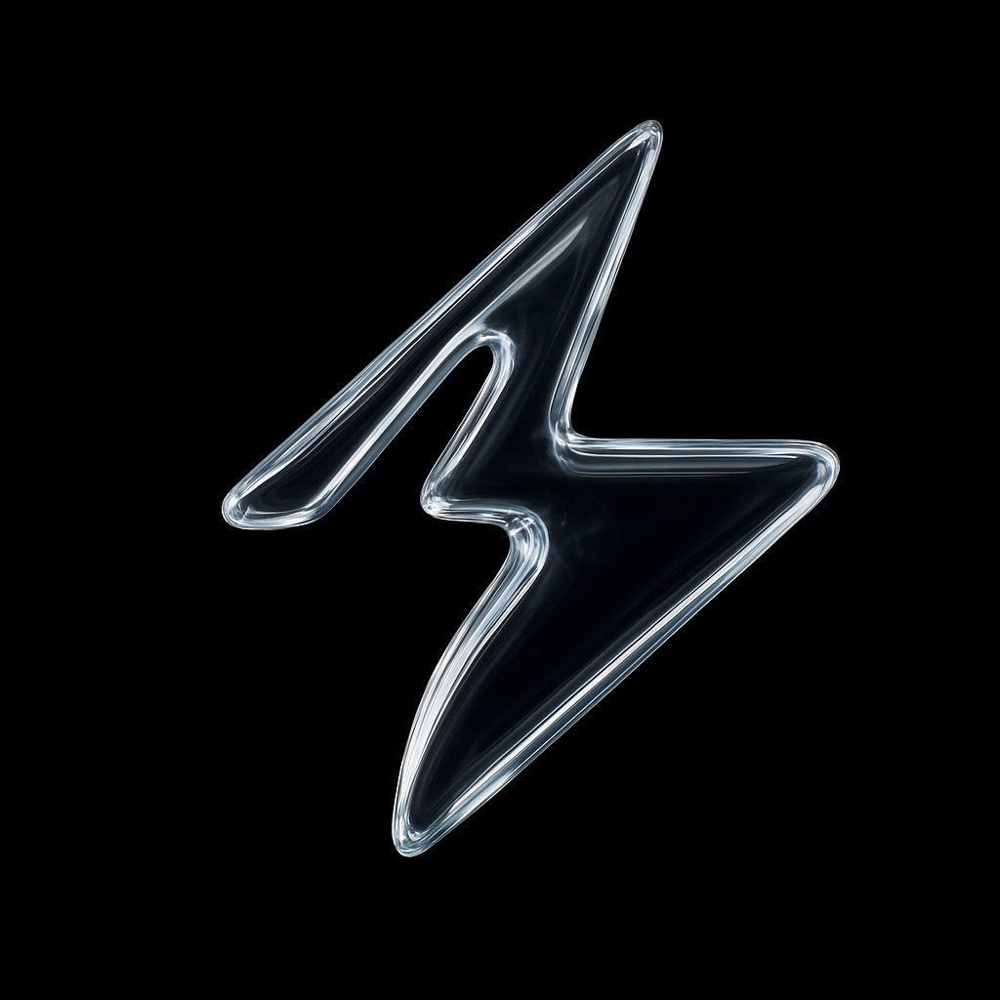

# Patch Prompter

| | |
| --- | --- |
| Author | Cameron Browning |
| Last Updated | 08/14/2025 |

---

## 1. Overview

**Patch Prompter** is a **node-based workflow tool** for generating AI prompts — text and image — designed for artists, creative directors, and studios. Think of it as a “patch programming” playground for generative AI, in the spirit of [TouchDesigner](https://derivative.ca/), [vvvv](https://vvvv.org/), [Blender Geometry Nodes](https://docs.blender.org/manual/en/latest/modeling/geometry_nodes/introduction.html), [Max](https://cycling74.com/products/max), or [ComfyUI](https://www.comfy.org/).

While ComfyUI focuses on complex, repeatable workflows for local models, **Patch Prompter** is a lightweight, shareable layer for creating and sending prompt batches to *any* AI model. It saves and shares prompt data, tracks results, and uses **observability + human-in-the-loop feedback** to improve prompts over time — helping artists make better images and motion work faster.

---

## 2. Why Now? (Impetus)

Right now, professional artists at large studios use fragmented, homegrown workflows. They piece together prompts through trial and error, often guided by shared techniques that don’t always align with how models *actually* work.

**The opportunity:**  
- Capture and share *what actually works* in prompts.  
- Build a living library of prompt “components” with proven results.  
- Give creatives better starting points and repeatable successes.  
- Shorten the path from idea → high-quality output for clients.  

---

## 3. Use Case & Workflow

Example: A Creative Director (CD) wants to define and scale a *look* for a campaign.

1. **Create** – CD builds a patch in Patch Prompter to get their desired look.  
2. **Rate** – CD up/downvotes outputs during iteration.  
3. **Export** – CD downloads the best images (auto-flagging them as “high quality” in the database). Each download embeds the prompt metadata.  
4. **Share** – Artists import these files, reconstruct the patch, and adapt it for their work.  
5. **Improve** – Over the project, teams add refinements to prompts, growing the component library.  
6. **Observe** – Executive CDs see which outputs and prompt components are most effective across projects (via Langsmith).  
7. *(Stretch goal)* – CD can describe the project in plain English, and Patch Prompter suggests prompt components via RAG.

This ensures **prompt + model metadata is never lost** — and others can recreate results even without Patch Prompter.

---

## 4. Prototype & Early Demo

  
Prototype here → [link](prototype/)

---

## 5. AI Features — MVP (v0.1)

- **Prompt Engineering Playground**  
  - Simple, browser-based tool for experimenting with prompt variations.  
  - Collects user ratings (upvotes, downloads) to identify effective prompts.  
- **Observability Tools (Langsmith)**  
  - Track how prompts evolve, tokenization patterns, and output quality.  
  - Let stakeholders explore great prompts — even those not chosen in final delivery.

**Core bet:** Improving prompt design is a *high-leverage point* in creative workflows. The goal is more, better images — faster — while keeping artists in control.

---

## 6. Roadmap — Beyond MVP

- **v1.1 – Evaluation Frameworks**  
  - Metrics: images/session, “creative opportunity,” project margin.  
  - Insight: Which words/styles correlate with profit.  
- **v1.2 – Structured Outputs**  
  - Agentic layer generates patches automatically from top-rated components.  
- **v2.0 – Wider Observability**  
  - Opt-in data sharing across users for trend spotting.

---

## 7. Technical Approach

  

- **Backend:** Repl.it (API)  
- **Frontend:** React + React Flow (node editor)

---

## 8. Example Prompts & Outputs

**Reference 1** (via [PromptHero](https://prompthero.com/guides/chatgpt-json-guide/))

Prompt:
```json
{
  "title": "Clear Iridescent Glass Form",
  "viewAngle": "Orthographic straight-on",
  "background": {
    "color": "#ffffff",
    "lighting": "Soft top studio light"
  },
  "materialsAndTextures": [
    { "type": "Transparent glass", "description": "Rounded edges with internal glow" },
    { "type": "Iridescent core", "colors": ["#f8e1ff", "#dff8ff", "#fff6d2", "#ebd4ff"] }
  ],
  "lighting": {
    "reflections": "Highlight edges",
    "shadow": "Soft drop below"
  }
}
```

Output:  
  

Suggested UI for Prompt Patcher:  


---

**Reference 2** (via [@egeberkina on Twitter](https://x.com/egeberkina/status/1936399147088961705))

Prompt:
```json
{
  "style_name": "Transparent Studio Render",
  "visual_rules": {
    "form": {
      "shape": "preserve original object shape",
      "outline": "no outlines, use smooth geometry transitions and bevels"
    },
    "lighting": {
      "style": "studio-style 3-point lighting or soft HDRI setup",
      "highlight": "subtle specular highlights for semi-matte plastic or coated surfaces",
      "shadow": "soft drop shadow directly beneath the object, cast on a translucent floor plane"
    },
    "texture": {
      "surface": "smooth or lightly textured based on object, clean shader setup with minimal noise",
      "branding": "bold and high-contrast, treated as printed decals or sticker-style labels"
    },
    "material": {
      "finish": "semi-matte or satin shader, mimicking printed plastic or coated materials"
    },
    "color_handling": {
      "strategy": "make the object's primary color the focal point",
      "enhancement": "slightly boosted saturation and contrast for clean product visualization"
    },
    "background": {
      "type": "fully transparent (alpha channel)",
      "shadow": "optional soft drop shadow directly beneath the object to ground it visually"
    }
  },
  "rendering": {
    "camera_angle": "centered front view or slightly elevated for dimensional clarity",
    "depth_of_field": "neutral or slightly shallow to keep object fully sharp",
    "background_blur": "none, background remains transparent"
  }
}
```

Output:  
  

Suggested UI for Prompt Patcher:  


---

**Other Useful Output Structures**
- Image batches (same prompt/different seeds or varied components)  
- Color pickers (Hex, RGB, HSV)  
- Image input relationships (track source images alongside outputs)  

---

## 9. Evaluation Strategy

**Output Metrics**  
- Upvotes, downvotes, deletes, downloads, reports/flags.  
- Engagement cascades to underlying components → “Best Prompts” suggestions.  

**UX Success Metrics**  
- If artists prefer Patch Prompter over ChatGPT/Krea in real work.  
- Track retention in limited beta → wider release if usage holds.  

---

## 10. Observability Plan

- Human-in-the-loop ratings + Langsmith tracking for deeper visibility.  
- Extra metadata structure to spot trends, unique styles, and high-performing prompt elements.

---

## 11. Development Estimate (v0.1)

| resource | effort estimate |
|--- | ---|
| Lead Creative Technologist | 2 weeks for UX design and implementation |
| Sr Engineer | 2 weeks for human-in-the-loop design and implementation + observability |
| QA Specialist | 1 week QA planning and testing |

---

### TL;DR
Patch Prompter is **Figma for AI prompts** — a shareable, visual, feedback-driven system to make creative AI work faster, better, and more consistent. It keeps the artistry, adds observability, and builds a living library of *what works*.


*Note: this proposal was written by Cameron Browning without AI assistance 8/11–8/14, 2025, and edited by ChatGPT 5 on 8/14/2025. The edited content was reviewed and approved by the author. You can find [the unedited version here](https://github.com/camb416/patch-prompter/tree/human-only)*
